# AWS Activity

An event-driven ETL pipeline built on AWS Glue, orchestrated with Glue Workflows,
triggered automatically via S3 + Lambda, and deployed end-to-end through
GitHub Actions.

```
Upload CSV → S3 (input/) → S3 event notification → Lambda
    → Glue Workflow
        → Crawler #1 (catalogs input/)
        → Python Shell Job (transforms data)
        → Crawler #2 (catalogs output/)
    → S3 (output/<filename>_transformed.csv)
```

All screenshots referenced below are in `screenshots/`, numbered in the order
the pipeline was actually built.

---
## Architecture Diagram
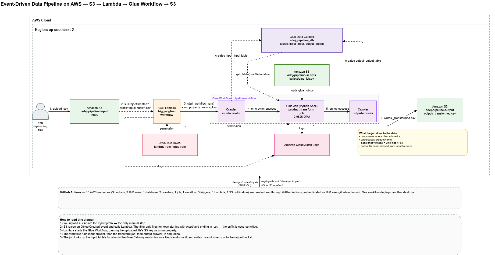

## AWS Resources Used

- **S3** — three separate buckets: input, output, and scripts
- **S3 Event Notification** — invokes Lambda when a `.csv` is created under `input/`
- **Lambda** — receives the S3 event and starts the Glue Workflow
- **AWS Glue Data Catalog** — one database holding two tables (input + output)
- **AWS Glue Crawlers** — two crawlers, populate the catalog tables from S3
- **AWS Glue Job** — Python Shell job that transforms the CSV
- **AWS Glue Workflow** — orchestrates crawler → job → crawler as one chain
- **IAM Roles** — `lambda-role`, `glue-role` (least-privilege-ish, see note below)
- **IAM User** — `github-actions-ci`, the credential GitHub Actions authenticates
  with to create/destroy the resources above (see note below)

## Resource Names

Region: `ap-southeast-2`

| Resource                            | Name                      |
| ----------------------------------- | ------------------------- |
| Input bucket                        | `adej-pipeline-input`   |
| Output bucket                       | `adej-pipeline-output`  |
| Scripts bucket                      | `adej-pipeline-scripts` |
| Glue database                       | `adej_pipeline_db`      |
| Input table (via crawler)           | `input_input`           |
| Output table (via crawler)          | `output_output`         |
| Crawler (input)                     | `input-crawler`         |
| Crawler (output)                    | `output-crawler`        |
| Glue job                            | `product-transform-job` |
| Glue workflow                       | `pipeline-workflow`     |
| Lambda function                     | `trigger-glue-workflow` |
| Lambda IAM role                     | `lambda-role`           |
| Glue IAM role                       | `glue-role`             |
| CI-only IAM user (manual, one-time) | `github-actions-ci`     |

## Build Phases

1. **IAM Roles** — created `lambda-role` and `glue-role` with the permissions each service needs.
2. **S3 Buckets** — created three buckets: input, output, and scripts.
3. **Glue Database** — created an empty Glue Catalog database (`adej_pipeline_db`) as the namespace for tables.
4. **Crawler #1 (input)** — created and ran a crawler against `input/`, generating the `input_input` catalog table.
5. **Glue Job** — wrote and ran a Python Shell job that reads the input table's location from the catalog, transforms the data, and writes the result to the output bucket.
6. **Crawler #2 (output)** — created and ran a second crawler against `output/`, generating the `output_output` catalog table.
7. **Glue Workflow** — chained the crawler → job → crawler sequence into one orchestrated workflow (`pipeline-workflow`), tested manually end-to-end.
8. **Lambda** — created `trigger-glue-workflow`, which starts the Glue Workflow and passes the uploaded file's S3 key through as a workflow run property.
9. **S3 Event Notification** — wired the input bucket to invoke Lambda automatically on any `.csv` upload under `input/`.
10. **End-to-end validation** — confirmed a real CSV upload triggers the full chain automatically, with per-file output naming (no manual clicks).
11. **CI IAM User & Access Keys** — created a dedicated IAM user (`github-actions-ci`), separate from any personal AWS login, with programmatic-only access. Generated an access key pair and added them as GitHub repository secrets (`AWS_ACCESS_KEY_ID`, `AWS_SECRET_ACCESS_KEY`) so GitHub Actions could authenticate to AWS without exposing any personal credentials.
12. **GitHub Actions CI/CD** — rewrote every step above (1–9) as AWS CLI commands in `deploy.sh`/`destroy.sh`, wrapped in GitHub Actions workflows (`deploy.yml`, `destroy.yml`), using the credentials from step 11.
13. **Idempotency & Destroy/Redeploy test** — re-ran `deploy.sh` against an already-built environment to confirm it only reports "already exists, skipping" rather than erroring or duplicating; then ran `destroy.sh` followed by `deploy.sh` again to prove the entire pipeline can be torn down and rebuilt from nothing.

---

## 1. Manual build (proving the design first)

Before automating anything, every piece was but and tested by hand in the
AWS Console. This is the same order a person would click through, and it's
what the CI script in `scripts/deploy.sh` later recreates as code.

### 1.1 IAM Roles

Search **IAM** -> `Roles` -> `Trusted Entity Type`: AWS Service -> `Use Case` -> `Select Permission Policies` -> `Role Name` -> `Create Role`

Two roles were created first, since every other service depends on them:

- **`lambda-role`**

`Use Case`: 'Lambda  
`Select Permission Policies`:  
->AmazonS3ReadOnlyAccess (to read s3)  
->AWSGlueConsoleFullAccess (to start glue jobs/workflows)  
->CloudWatchLogsFullAccess (to write logs)  
`Name`: 'lambda-role'

- **`glue-role`**

`Use Case`: 'Glue'  
`Select Permission Policies`:  
->AmazonS3FullAccess (to read and write S3)  
->AWSGlueServiceRole (baseline permission)  
->CloudWatchLogsFullAccess (to write logs)  
`Name`: 'glue-role'


### 1.2 S3 Buckets

Search **S3** -> `Create Bucket` -> `Bucket Name` -> `Block all publiuc access` -> `Bucket Versioning`: Disable -> `Default Encryption`: SSE-S3 -> `Create Bucket`

Three separate buckets (per-file separation, rather than one bucket with
prefixes ):

- `adej-pipeline-input/input/` — where CSVs are uploaded
- `adej-pipeline-output/output/` — where transformed results land
- `adej-pipeline-scripts/scripts/` — holds the Glue job's Python script


### 1.3 Glue Database (the Catalog namespace)

Search `AWS Glue` -> `Data Catalog` -> `Databases` -> `Add Database` -> `Database type`: Glue Database -> `Name`: adej_pipeline_db -> `Description`: Catalog for event-driven CSV pipeline -> `Create Database`

An empty Glue Database (`adej_pipeline_db`) was created to hold the catalog
tables that crawlers would later populate.


### 1.4 Crawler #1 — catalogs the input data

`AWS Glue` -> `Data Catalog`-> `Crawlers` -> `Create Crawlers` -> `Name`:**input-crawler** -> `Data source configuration`: Not yet -> `Add a data source` -> `Data source`: S3 -> `Location of S3 data`: In this account -> `Browse S3`: **s3://adej-pipeline-input/input/** -> `Subsequent Crwaler Runs`: Crawl All sub folders -> `Add an S3 datasource` -> Next -> `IAM Role` -> Use another role: **glue-role** ->`Target Database`: **adej-pipeline_db** -> `Table name prefix`: input_ -> `Crawler schedule`: On demand -> `Create Crawler`

Points at `s3://adej-pipeline-input/input/`, infers the CSV schema, and creates a table (`input_input`) in the catalog.


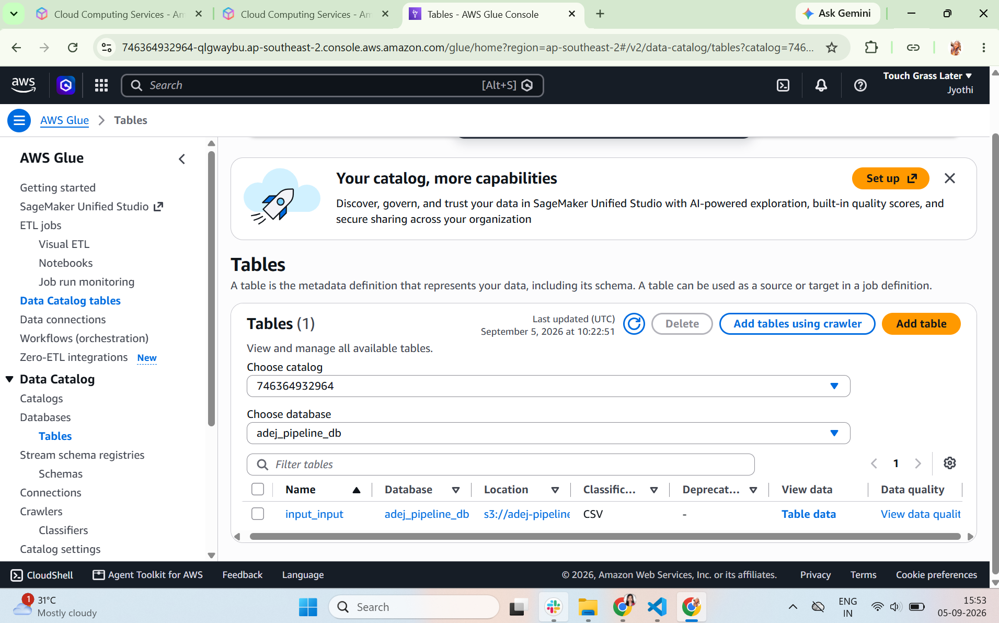
*The input_input table appears in the Glue Data Catalog after the crawler run.*

### 1.5 Glue Job — the transform

A **Python Shell** job (`product-transform-job`, 0.0625 DPU, 10 min timeout)
that:

1. Looks up the input table's location in the Glue Catalog
2. Reads the CSV directly from S3 (`boto3` + `pandas`)
3. Drops discontinued items (`discontinued == 1`)
4. Uppercases `productName`
5. Adds `priceWithTax = unitPrice * 1.1`
6. Writes the result to the output bucket

**Input** (`products.csv`)

```csv
productID,productName,quantityPerUnit,unitPrice,discontinued,categoryID
1,Chai,10 boxes x 20 bags,18,0,1
5,Chef Anton's Gumbo Mix,36 boxes,21.35,1,2
```

**Output** (`products_transformed.csv`)

```csv
productID,productName,quantityPerUnit,unitPrice,discontinued,categoryID,priceWithTax
1,CHAI,10 boxes x 20 bags,18,0,1,19.8
```

(Row 5 is dropped — `discontinued == 1`.)


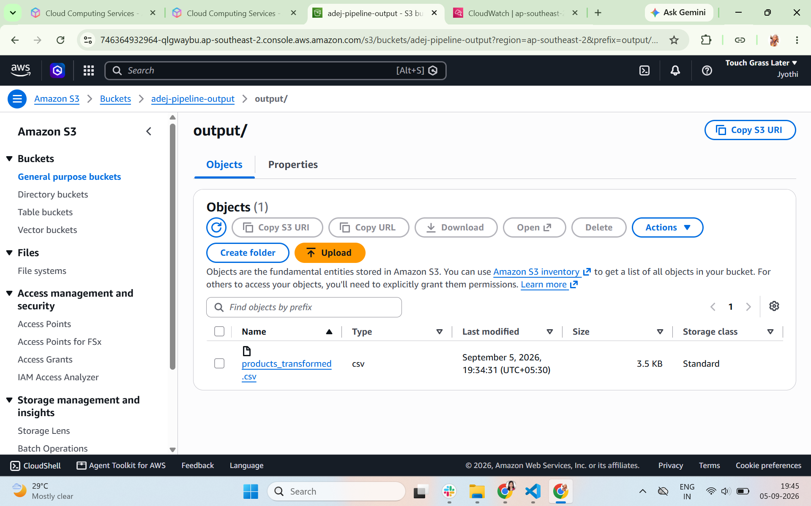
*products_transformed.csv appears in the output bucket.*


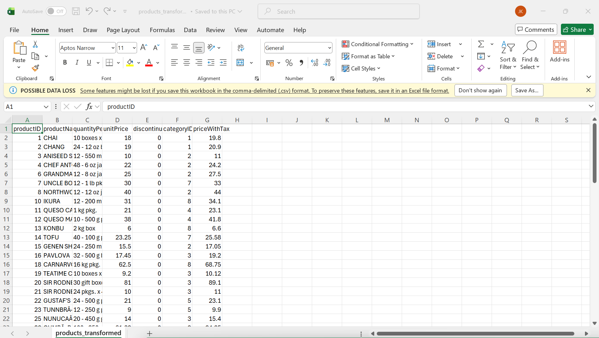
*Output file opened in Excel: discontinued rows dropped, names uppercased, priceWithTax added.*

### 1.6 Crawler #2 — catalogs the output data

Points at `s3://adej-pipeline-output/output/`, creating a second table
(`output_output`) so the transformed data is also queryable (e.g. via Athena).

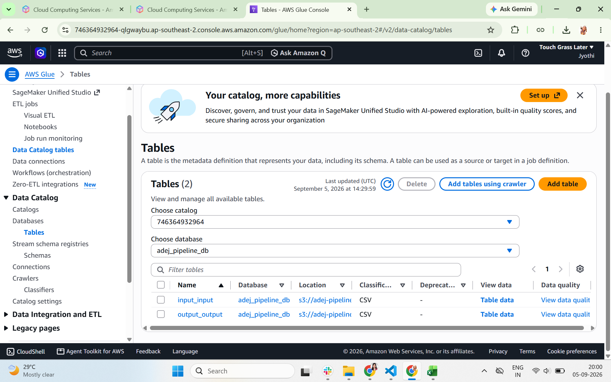
*Both input_input and output_output tables now listed in the catalog.*


### 1.7 Glue Workflow — orchestration

Chains the three pieces above into one sequence, so the whole thing runs with
a single trigger instead of three manual clicks:

```
start-trigger → input-crawler → after-input-crawler
    → product-transform-job → after-job → output-crawler
```


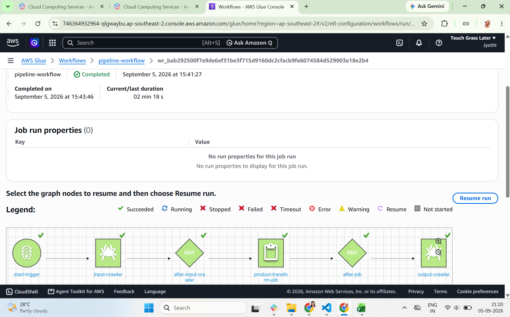
*First full manual run of the workflow completes, every node succeeded.*

### 1.8 Lambda — the automatic entry point

A small Lambda function (`trigger-glue-workflow`) that calls
`glue.start_workflow_run()`, passing along the exact S3 key that was uploaded
(via workflow **run properties**) so the job processes only that file, not
everything in the bucket.


### 1.9 S3 Event Notification

A rule on the input bucket: whenever an object matching `prefix=input/`,
`suffix=.csv` is created, invoke the Lambda above. This is what makes the
whole thing actually event-driven rather than manually triggered.


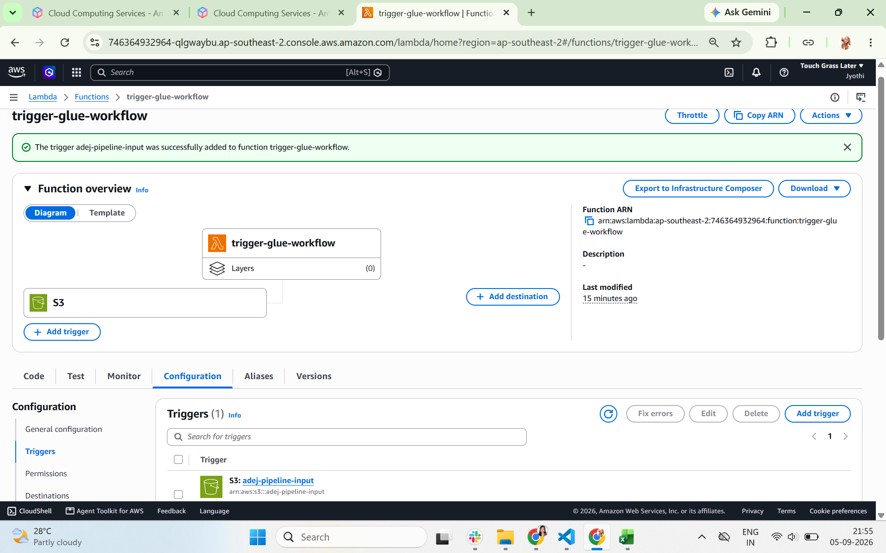
*S3 trigger now attached to the Lambda function.*

### 1.10 End-to-end proof (manual)

Uploading a real CSV produced a uniquely-named output file per input file
(`products_transformed.csv`, `products_1_transformed.csv`, …), confirming the
whole chain — S3 → Lambda → Workflow → Crawler → Job → Crawler — works without
any manual intervention.

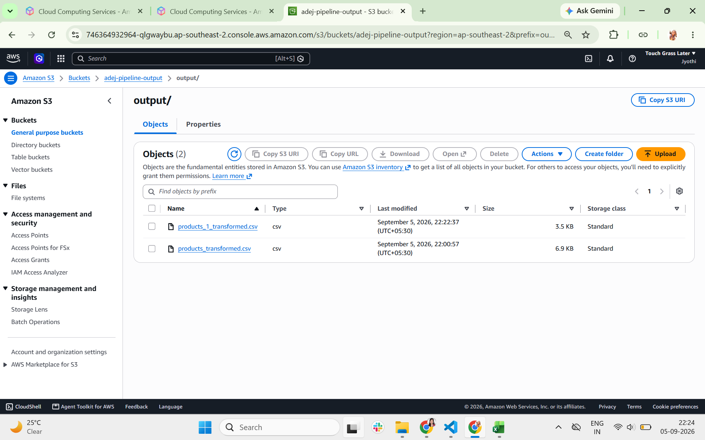
*Two separate, correctly-named output files after fixing per-file output naming.*

---

## 2. Automating it: GitHub Actions CI/CD

Once the manual build was fully verified, every resource above was rewritten
as AWS CLI commands in [`scripts/deploy.sh`](scripts/deploy.sh), wrapped in a
GitHub Actions workflow. No Terraform — plain AWS CLI, chosen since it needed
no new tooling on top of everything else being learned.

### 2.1 Repository structure

```
.
├── .github/workflows/
│   ├── deploy.yml       # recreates every AWS resource, idempotent
│   └── destroy.yml      # tears everything down
├── iam/                 # trust policies for the two IAM roles
├── scripts/
│   ├── deploy.sh
│   └── destroy.sh
├── sample-input/
│   └── products.csv   
├── glue_job.py
└── lambda_function.py
```


### 2.2 CI-specific IAM user

A dedicated IAM user (`github-actions-ci`) was created — separate from any
personal AWS login — with access keys stored as GitHub repository secrets
(`AWS_ACCESS_KEY_ID`, `AWS_SECRET_ACCESS_KEY`).

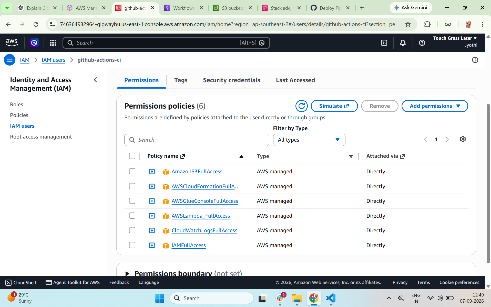
*Permissions attached to the github-actions-ci IAM user before creation.*


### 2.3 `deploy.sh` — idempotent, safe to re-run

Every resource creation is guarded by an existence check (`aws ... get-... || create-...`), so running `deploy.sh` against an already-built environment just
confirms everything is in place rather than erroring or duplicating anything.
The very last step uploads `sample-input/products.csv` to the input bucket —
since the S3 notification is wired up by this point in the script, this
upload triggers a **real** run of the pipeline as a built-in smoke test.


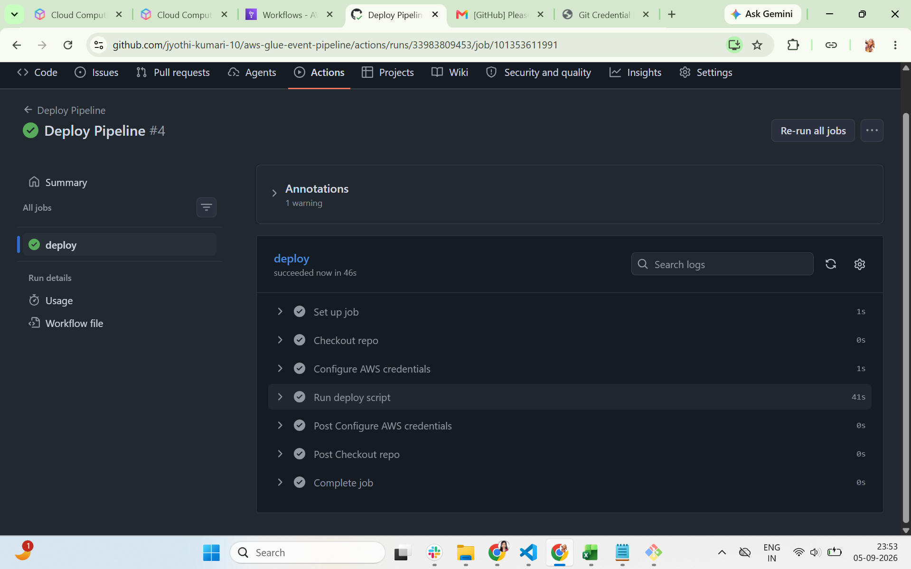
*Deploy Pipeline run completes successfully end to end.*

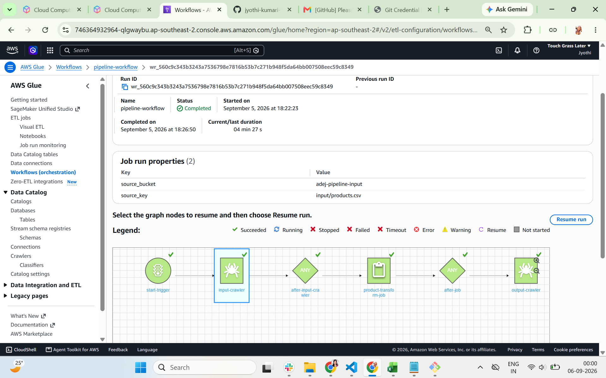
*A new Glue Workflow run appears, triggered by the file CI uploaded.*

### 2.4 `destroy.sh` — proving it's genuinely reproducible

Tears down every resource in reverse order (Lambda → Workflow/triggers → Job
→ Crawlers → Database → S3 buckets → IAM roles). Running **destroy → deploy**
back-to-back is the real test of "infrastructure as code": it proves the
whole pipeline can be rebuilt from nothing, not just that it worked once.

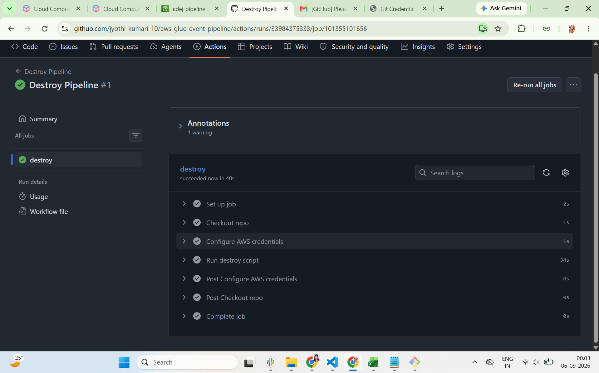
*Destroy Pipeline run completes, tearing down every AWS resource.*

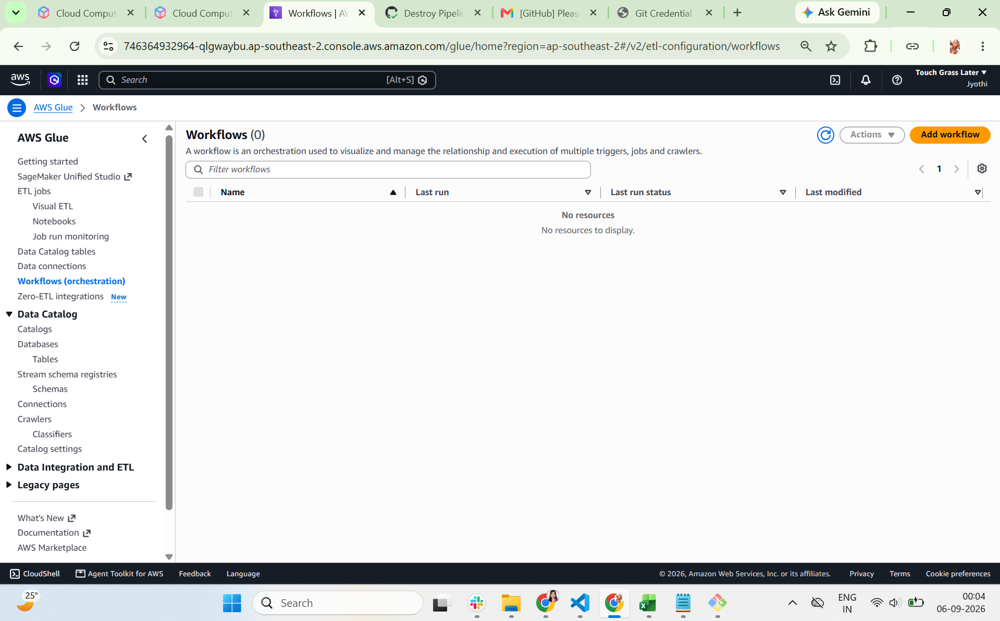
*Glue Workflows list is empty, confirming Destroy removed pipeline-workflow.*

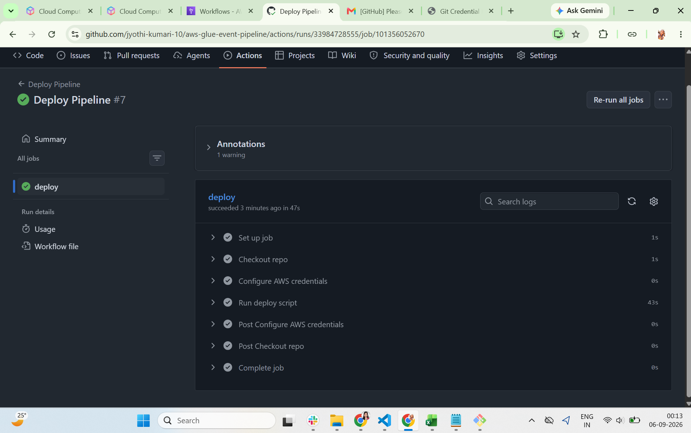
*Deploy Pipeline re-run after Destroy, rebuilding everything from nothing.*

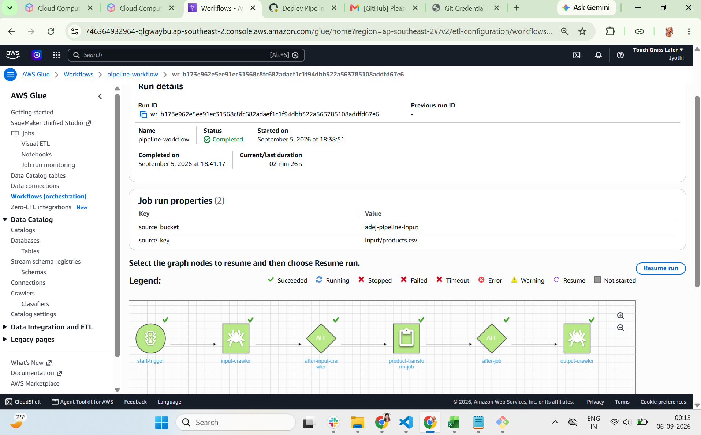
*Fresh workflow run after redeploy, all nodes succeeded again.*

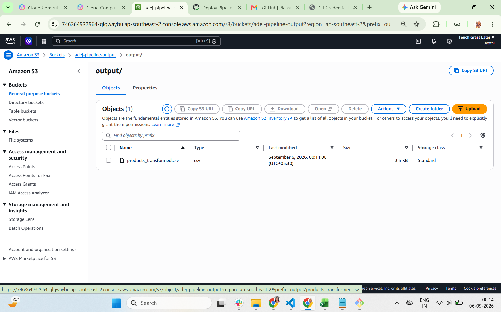
*Output bucket after redeploy, containing the freshly generated file.*

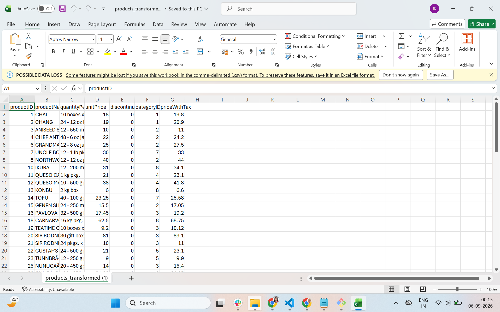
*Final output re-verified in Excel after the full destroy/redeploy cycle.*

---

## Local / manual testing

To re-run the pipeline manually without touching CI:

1. Upload any CSV with columns `productID, productName, quantityPerUnit, unitPrice, discontinued, categoryID` to `s3://adej-pipeline-input/input/`
2. Watch **Glue → Workflows → pipeline-workflow → History** for a new run
3. Check `s3://adej-pipeline-output/output/` for `<filename>_transformed.csv`

To deploy/destroy via CI: go to the repo's **Actions** tab → select **Deploy
Pipeline** or **Destroy Pipeline** → **Run workflow**.

---

## What to Verify

- [ ] CSV appears under `input/` in the input bucket
- [ ] Lambda's CloudWatch logs show the upload event and a Glue workflow run ID
- [ ] Glue Workflow History shows all six nodes (start-trigger →
  input-crawler → after-input-crawler → product-transform-job →
  after-job → output-crawler) as **Succeeded**
- [ ] A new table appears/refreshes in the Glue Catalog for both `input/`
  and `output/`
- [ ] Transformed CSV appears under `output/<filename>_transformed.csv`
- [ ] Re-running `deploy.sh` (via Actions) reports `already exists, skipping` for every resource — proves idempotency, not just a
  one-time success

## Cost Controls

- Glue job runs as a **Python Shell job on 0.0625 DPU** — the smallest,
  cheapest option, appropriate since the dataset is tens of rows
- **Job timeout capped at 10 minutes** — prevents a runaway job from
  burning compute indefinitely
- Lambda and the Glue Workflow only run **on-demand / event-triggered** —
  nothing polls or runs on a schedule
- **No EC2, no NAT Gateway, no always-on compute** anywhere in the pipeline
- All three S3 buckets have **public access fully blocked**

## Cleanup

Run the **Destroy Pipeline** workflow (Actions tab) to remove every AWS
resource `deploy.sh` created: Lambda, the Glue Workflow and its triggers,
the Glue Job, both Crawlers, the Glue Database (and its tables), all three
S3 buckets (contents included), and both `lambda-role`/`glue-role` IAM
roles.

**What Destroy does *not* touch:** the `github-actions-ci` IAM user and its
access keys. That user was created manually, one time, specifically so
GitHub Actions itself has credentials to run `deploy.sh`/`destroy.sh` — it
was never part of what those scripts manage, which is exactly why
Destroy → Deploy can run back-to-back without locking you out of your own
CI.
