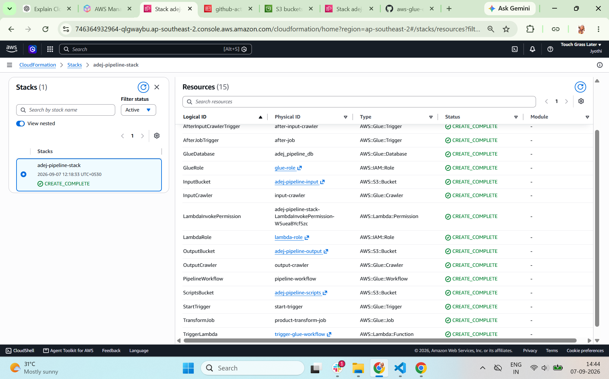
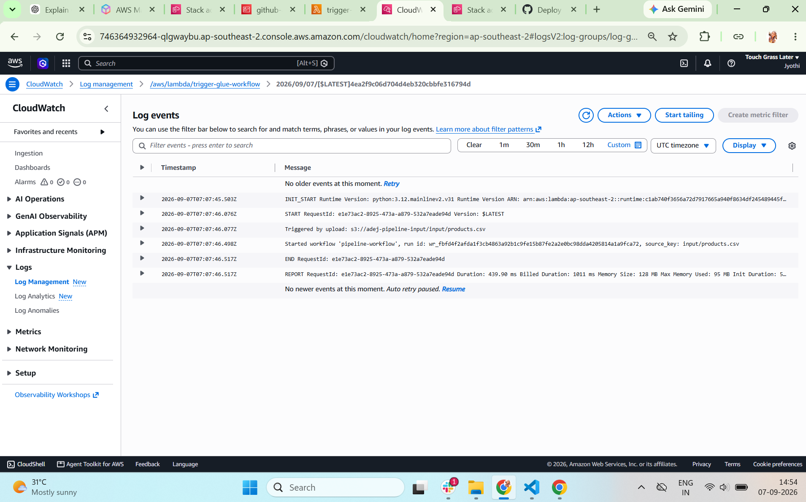
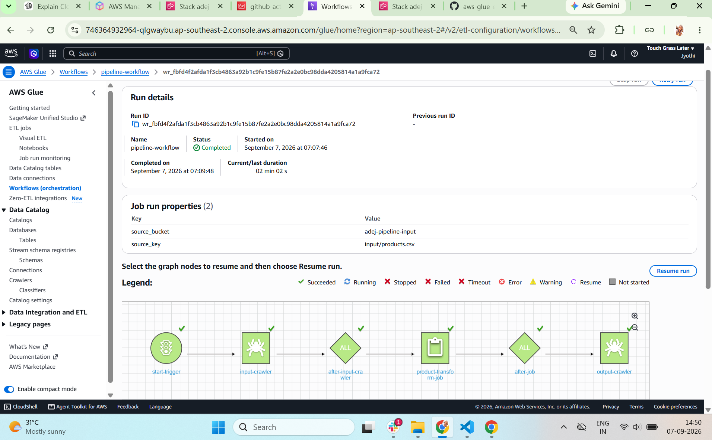
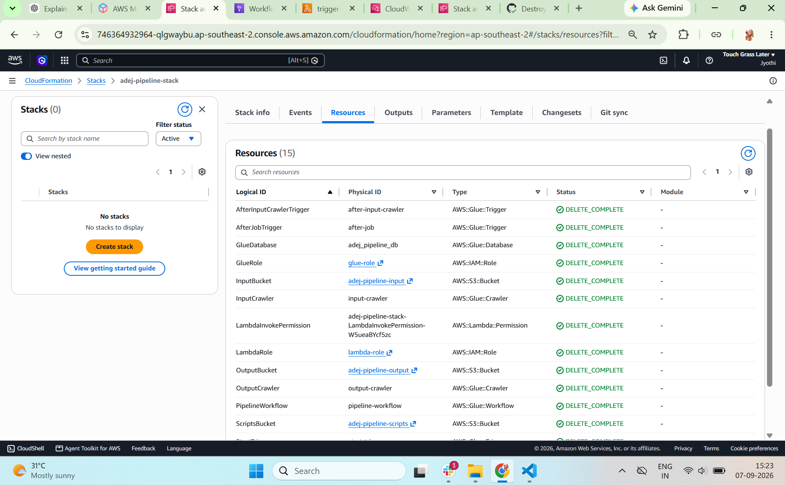

# AWS Activity

An event-driven ETL pipeline built on AWS Glue, orchestrated with Glue Workflows,
triggered automatically via S3 + Lambda, and deployed end-to-end through
GitHub Actions.

```
Upload CSV → S3 (input/) → S3 event notification → Lambda
    → Glue Workflow
        → Crawler #1 (catalogs input/)
        → Python Shell Job (transforms data)
        → Crawler #2 (catalogs output/)
    → S3 (output/<filename>_transformed.csv)
```

All screenshots referenced below are in `screenshots/`, numbered in the order
the pipeline was actually built.

---

## Architecture Diagram


## AWS Resources Used

- **S3** — three separate buckets: input, output, and scripts
- **S3 Event Notification** — invokes Lambda when a `.csv` is created under `input/`
- **Lambda** — receives the S3 event and starts the Glue Workflow
- **AWS Glue Data Catalog** — one database holding two tables (input + output)
- **AWS Glue Crawlers** — two crawlers, populate the catalog tables from S3
- **AWS Glue Job** — Python Shell job that transforms the CSV
- **AWS Glue Workflow** — orchestrates crawler → job → crawler as one chain
- **IAM Roles** — `lambda-role`, `glue-role` (least-privilege-ish, see note below)
- **IAM User** — `github-actions-ci`, the credential GitHub Actions authenticates
  with to create/destroy the resources above (see note below)

## Resource Names

Region: `ap-southeast-2`

| Resource                            | Name                      |
| ----------------------------------- | ------------------------- |
| Input bucket                        | `adej-pipeline-input`   |
| Output bucket                       | `adej-pipeline-output`  |
| Scripts bucket                      | `adej-pipeline-scripts` |
| Glue database                       | `adej_pipeline_db`      |
| Input table (via crawler)           | `input_input`           |
| Output table (via crawler)          | `output_output`         |
| Crawler (input)                     | `input-crawler`         |
| Crawler (output)                    | `output-crawler`        |
| Glue job                            | `product-transform-job` |
| Glue workflow                       | `pipeline-workflow`     |
| Lambda function                     | `trigger-glue-workflow` |
| Lambda IAM role                     | `lambda-role`           |
| Glue IAM role                       | `glue-role`             |
| CI-only IAM user (manual, one-time) | `github-actions-ci`     |

## Build Workflow

```text
1. IAM Roles
      ↓
2. S3 Buckets
      ↓
3. Glue Database
      ↓
4. Crawler #1
      ↓
5. Glue Job
      ↓
6. Crawler #2
      ↓
7. Glue Workflow
      ↓
8. Lambda
      ↓
9. S3 Event Notification
      ↓
10. End-to-End Validation
      ↓
11. CI IAM User & Access Keys
      ↓
      ┌──────────────────────────────┐
      │            CI/CD             │
      └──────────────┬───────────────┘
                     ↓
          ┌──────────┴──────────┐
          ↓                     ↓
12. GitHub Actions        13. CloudFormation
    CI/CD (AWS CLI)           CI/CD
                                    ↓
                           14. CloudFormation
                               Validation
```

## Build Phases

1. **IAM Roles** — created `lambda-role` and `glue-role` with the permissions each service needs.
2. **S3 Buckets** — created three buckets: input, output, and scripts.
3. **Glue Database** — created an empty Glue Catalog database (`adej_pipeline_db`) as the namespace for tables.
4. **Crawler #1 (input)** — created and ran a crawler against `input/`, generating the `input_input` catalog table.
5. **Glue Job** — wrote and ran a Python Shell job that reads the input table's location from the catalog, transforms the data, and writes the result to the output bucket.
6. **Crawler #2 (output)** — created and ran a second crawler against `output/`, generating the `output_output` catalog table.
7. **Glue Workflow** — chained the crawler → job → crawler sequence into one orchestrated workflow (`pipeline-workflow`), tested manually end-to-end.
8. **Lambda** — created `trigger-glue-workflow`, which starts the Glue Workflow and passes the uploaded file's S3 key through as a workflow run property.
9. **S3 Event Notification** — wired the input bucket to invoke Lambda automatically on any `.csv` upload under `input/`.
10. **End-to-end validation** — confirmed a real CSV upload triggers the full chain automatically, with per-file output naming (no manual clicks).
11. **CI IAM User & Access Keys** — created a dedicated IAM user (`github-actions-ci`), separate from any personal AWS login, with programmatic-only access. Generated an access key pair and added them as GitHub repository secrets (`AWS_ACCESS_KEY_ID`, `AWS_SECRET_ACCESS_KEY`) so GitHub Actions could authenticate to AWS without exposing any personal credentials.
12. **GitHub Actions CI/CD - AWS CLI implementation** — rewrote every step above (1–9) as AWS CLI commands in `deploy.sh`/`destroy.sh`, wrapped in GitHub Actions workflows (`deploy.yml`, `destroy.yml`), using the credentials from step 11.
13. **CloudFormation CI/CD — extra-credit implementation** — defined the pipeline infrastructure declaratively in `cloudformation/pipeline.yaml`, covering the AWS resources required by the pipeline. Added separate GitHub Actions workflows (`deploy-cfn.yml`, `destroy-cfn.yml`) to create/update and delete the CloudFormation stack.
14. **CloudFormation deployment validation** — deployed the CloudFormation template through GitHub Actions and verified that the `adej-pipeline-stack` CloudFormation stack reached `CREATE_COMPLETE`. This provides an alternative infrastructure-as-code deployment path
    alongside the AWS CLI implementation.

---

## Automating it: GitHub Actions CI/CD

Once the manual build was fully verified, the infrastructure was automated
using two deployment approaches:

1. **AWS CLI-based deployment** — AWS CLI commands are defined in
   [`scripts/deploy.sh`](scripts/deploy.sh) and
   [`scripts/destroy.sh`](scripts/destroy.sh), and executed through
   [`deploy.yml`](.github/workflows/deploy.yml) and
   [`destroy.yml`](.github/workflows/destroy.yml).
2. **CloudFormation-based deployment** — the infrastructure is defined
   declaratively in
   [`cloudformation/pipeline.yaml`](cloudformation/pipeline.yaml) and
   deployed and destroyed through
   [`deploy-cfn.yml`](.github/workflows/deploy-cfn.yml) and
   [`destroy-cfn.yml`](.github/workflows/destroy-cfn.yml).

### Repository structure

```
.
├── .github/workflows/
│   ├── deploy.yml              # AWS CLI-based deployment
│   ├── destroy.yml             # AWS CLI-based teardown
│   ├── deploy-cfn.yml          # CloudFormation deployment
│   └── destroy-cfn.yml         # CloudFormation teardown
├── cloudformation/
│   └── pipeline.yaml           # CloudFormation infrastructure template
├── iam/                        # trust policies for the two IAM roles
├── scripts/
│   ├── deploy.sh               # AWS CLI deployment
│   └── destroy.sh              # AWS CLI teardown
├── sample-input/
│   └── products.csv   
├── glue_job.py
└── lambda_function.py
```

### CI-specific IAM user

A dedicated IAM user (`github-actions-ci`) was created — separate from any
personal AWS login — with access keys stored as GitHub repository secrets
(`AWS_ACCESS_KEY_ID`, `AWS_SECRET_ACCESS_KEY`).


*Permissions attached to the github-actions-ci IAM user before creation.*


### AWS CLI + GitHub Actions CI/CD

The deployment and teardown are implemented using:

- `scripts/deploy.sh`
- `scripts/destroy.sh`
- `.github/workflows/deploy.yml`
- `.github/workflows/destroy.yml`

The deployment was successfully executed through GitHub Actions and the
resulting AWS resources were verified in the AWS Console.


*Deploy Pipeline run completes successfully end to end.*


*A new Glue Workflow run appears, triggered by the file CI uploaded.*


*Transformed products data in Excel*


*Glue Workflows list is empty, confirming Destroy removed pipeline-workflow.*


### CloudFormation + GitHub Actions CI/CD — Extra Credit

The complete infrastructure was additionally defined using AWS CloudFormation.

- `cloudformation/pipeline.yaml`
- `.github/workflows/deploy-cfn.yml`
- `.github/workflows/destroy-cfn.yml`

 *The CloudFormation deployment successfully created the
`adej-pipeline-stack` with 15 resources.*

 *The deployed pipeline was then validated through the Lambda logs.*

*AWS Glue workflow completed successfully*

 *CloudFormation stack deletion completed successfully*

### Deployment approaches

| Approach | Infrastructure definition | GitHub Actions |
|---|---|---|
| AWS CLI | `deploy.sh` / `destroy.sh` | `deploy.yml` / `destroy.yml` |
| CloudFormation | `pipeline.yaml` | `deploy-cfn.yml` / `destroy-cfn.yml` |

## Local / manual testing

To re-run the pipeline manually without touching CI:

1. Upload any CSV with columns `productID, productName, quantityPerUnit, unitPrice, discontinued, categoryID` to `s3://adej-pipeline-input/input/`
2. Watch **Glue → Workflows → pipeline-workflow → History** for a new run
3. Check `s3://adej-pipeline-output/output/` for `<filename>_transformed.csv`

To deploy/destroy via CI, go to the repository's **Actions** tab.

For the AWS CLI implementation:
- Select **Deploy Pipeline** or **Destroy Pipeline**.

For the CloudFormation implementation:
- Select **Deploy Pipeline (CloudFormation)** or
  **Destroy Pipeline (CloudFormation)**.

Then select **Run workflow**.

---

## Cost Controls

- Glue job runs as a **Python Shell job on 0.0625 DPU** — the smallest,
  cheapest option, appropriate since the dataset is tens of rows
- **Job timeout capped at 10 minutes** — prevents a runaway job from
  burning compute indefinitely
- Lambda and the Glue Workflow only run **on-demand / event-triggered** —
  nothing polls or runs on a schedule
- **No EC2, no NAT Gateway, no always-on compute** anywhere in the pipeline
- All three S3 buckets have **public access fully blocked**

### What neither deployment touches

The `github-actions-ci` IAM user and its access keys are not managed by either
deployment implementation.

That user was created separately so GitHub Actions can authenticate to AWS.
It must therefore remain available for the CI/CD workflows to run.

